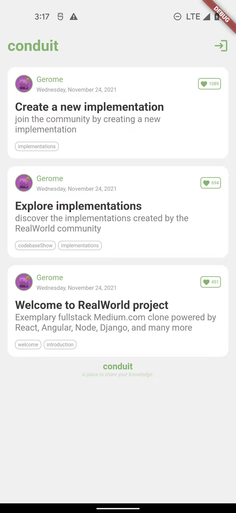

# 

> ### [Flutter/Dart] codebase containing real world examples (CRUD, auth, advanced patterns, etc) that adheres to the [RealWorld](https://github.com/gothinkster/realworld) spec and API.

### [Demo](https://demo.realworld.io/)&nbsp;&nbsp;&nbsp;&nbsp;[RealWorld](https://github.com/gothinkster/realworld)

This codebase was created to demonstrate a fully fledged fullstack application built with **Flutter/Dart** including CRUD operations, authentication, routing, pagination, and more.

We've gone to great lengths to adhere to the **Flutter/Dart** community styleguides & best practices.

For more information on how to this works with other frontends/backends, head over to the [RealWorld](https://github.com/gothinkster/realworld) repo.

# How it works

The project follows the general MVVM structure with flutter [Getx](https://github.com/jonataslaw/getx) libs.

Because of flutter is multi-platform, we can run this project on android, iOS, Windows, Linux, macOS!

There are some screenshot :

|  Platform   | ScreenShot  |
|  ----  | ----  |
| android  |  |
| macOS  |  |

# Getting started

run command line `flutter run` 

